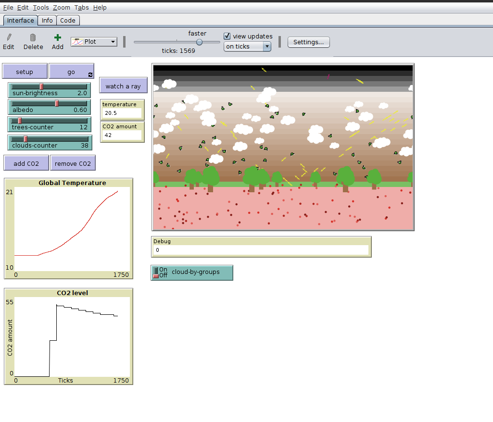
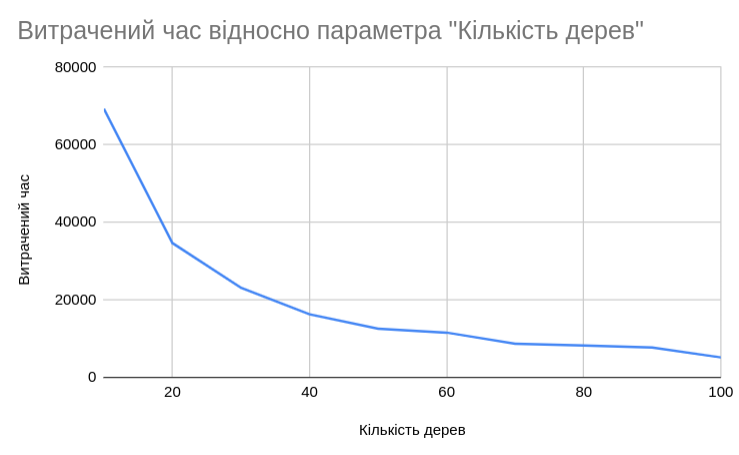

## Комп'ютерні системи імітаційного моделювання
## СПм-22-5, **Біліченко Олександр Олександрович**
### Лабораторна робота №**2**. Редагування імітаційних моделей у середовищі NetLogo

<br>

### Варіант 2, модель у середовищі NetLogo:
[Climate Change](http://www.netlogoweb.org/launch#http://www.netlogoweb.org/assets/modelslib/Sample%20Models/Earth%20Science/Climate%20Change.nlogo)

<br>

### Внесені зміни у вихідну логіку моделі, за варіантом:
______

#### Зміна способу вводу початкової кількості хмар
##### Проблема

В версії моделі за замовчуванням була можливість додавання хмар шляхом натискання на кнопку [**add cloud**](./images/add_cloud_btn.png). Це додавало групу хмар до поля симуляції. Кількість хмар визначалась випадково в значенні від 3 до 22. За показником кількості хмар неможливо було стежити з інтерфейсу моделі. Видалення відбувалось з видаленням цілої групи хмар з поля. За це відповідала кнопка [**remove cloud**](./images/remove_cloud_btn.png). Також неможливим було встановлення кількості хмар до запуску команди **Setup**.

##### Рішення

Заміна кнопок [**add cloud**](./images/add_cloud_btn.png), та [**remove cloud**](./images/remove_cloud_btn.png) на слайдер [**clouds counter**](./images//clouds_slider.png).

##### Посилення

- Додавання зміни режиму хмар з одиночного на груповий, при додаванні хмар на поле. За це відповідає кнопка Switch [**cloud-by-groups**](./images/switch.png). В режимі **On** до поля симуляції додається/видаляється одна группа хмар в випадковій кількості від 1 до 20. В режимі **Off** додавання та видалення відбувається по одному компоненту хмари.
- Додавання можливості предналаштування перед запуском команди **Setup**
- Збереження візуального ефекту плавного додавання / видалення компонентів хмар

##### Прикладне рішення
> Заміна кнопок

```nlogo
;; Заміна кнопок відбувалася шляхом додавання до графічного інтерфейсу слайдера та видалення кнопок відповідаючіх за додавання та видалення
;; Значення слайдеро було прив'язане до змінної clouds-counter
;; ця змінна є користувацьким інпутом, який задіяний в лозіці перерахування хмар:
to recalculate-clouds
  if clouds-counter = 0 [
    ask clouds [die]
    stop
  ]

  ifelse total-clouds > clouds-counter [
    let diff total-clouds - clouds-counter
    while [diff != 0] [
      remove-cloud
      set diff diff - 1
    ]
  ] [
    let diff clouds-counter - total-clouds
    while [diff != 0] [
      add-cloud
      set diff diff - 1
    ]
  ]
end
```

> Додавання зміни режиму хмар

```nlogo
;; Додавання зміни режиму хмар було забезпечено додаванням кнопки Switch 
;; Значення цієї кнопки було прив'язане до змінної cloud-by-groups
;; за допомогою цієї змінної ми визначаємо чи буде додаватись група хмар, чи лише одна
;; Було:

create-clouds 3 + random 20
  [
    ;; ...
  ]

;; Стало

ifelse cloud-by-groups [
  create-clouds 1 + random 21
  [
    ;; ...
  ]
] [
  create-clouds 1
  [
    ;; ...
  ]
]
```

> Додавання можливості предналаштування перед запуском команди **Setup**

```nlogo
;; Задля цього була визначена глобальна змінна total-clouds
;; за допомогою цієї змінної ми визначаємо скільки хмар нам треба ініціалізувати перед запуском команди **Setup**
;; Було додано:

to setup
  ;; ...
  set total-clouds clouds-counter
  ;;...
end
```

> Збереження візуального ефекту плавного додавання / видалення компонентів хмар

```nlogo
;; Глобальна змінна total-clouds, також використовується для передачі останнього зареєстрованого стану  слайдера
;; Порівняння зі значенням користувацького інпуту clouds-counter, дає можливість плавно додавати та прибирати хмари з поля
;; Було додано:

to go
  ;; ...
  if total-clouds != clouds-counter [
    recalculate-clouds
    set total-clouds clouds-counter
  ]
  ;;...
end
```

______

#### Зміна кута падіння нових сонячних промінів протягом часу
##### Проблема

В версії моделі за замовчуванням падіння сонячних променів завжди було під одним кутом, мало однакову інтенсивність, та постійний вплив на нагрівання землі. Це робило модель менш адекватною, та більш абстрактною, оскільки в реальному світі рух сонця є динамічним та непостійним, а також кут падіння має свої фізичні особливості.

##### Мета

Наблизити поведінку сонячного випромінювання до справжньої.

##### Рішення

- Зміна кута падіння променів на протязі часу;
- Адаптація інтенсивності впливу сонця, в залежності від часу доби

Для вирішення проблеми рівномірного переміщення сонця на протязі доби - модель було умовно поділено на рівні сектори. В данній імплементації поле було поділено на 64 сектори. 32 з яких відповідають за день та за ніч. День також розбитий на Ранок (1-8 сектори) День (9-24 сектори)та Вечір (25-32 сектори)

##### Посилення

- Додавання візуального ефекту зміни часу доби, завдяки зміні кольору ділянки неба.

##### Прикладне рішення
> Зміна кута падіння променів на протязі часу;

```nlogo
;; Приймаючі до уваги що день займає 32 сектори нам було потрібно рухати координату з якої починається сонячне випромінювання за годинниковою стрілкою
;; + 8 кроків по осі Y
;; + 16 кроків по осі Х
;; - 8 кроків по осі Y
;; Після цього починався період ночі (32 сектори)
;; Після останнього сектору координати скидались в початкове положення

;; Щодо зміни кута, було необхідно вирахувати на який кут має змінюватись кут падіння променів, а саме:
;; Додано:

to setup
  ;; ...
  set sunshine-angle-step (270 - 90) / 32
  ;;...
end

;; Також були додані показники кроків по осям X та Y.

to setup
  ;; ...
  set sectors-x-step (max-pxcor - min-pxcor) / 16 ;; time to go up on the sunrise and down on the sunset
  set sectors-y-step (max-pycor - earth-top + 1) / 8
  ;;...
end

;; Кожні 60 тіків змінюється сектор по колу від 1 до 64
;; Для адаптації була змінена логіка create sunshine
;; Було:

to create-sunshine
  if 10 * sun-brightness > random 50 [
    create-rays 1 [
      set heading 160
      ;; ...
    ]
  ]
end

;; Стало:

to create-sunshine
  if ticks mod 60 = 0 [
    if current-sector < 8 [
      ;; morning
      set current-sunshine-source-pycor current-sunshine-source-pycor + sectors-y-step
    ]

    if current-sector > 7 and current-sector < 24 [
      ;; day
      set current-sunshine-source-pxcor current-sunshine-source-pxcor + sectors-x-step
    ]

    if current-sector > 23 and current-sector < 32 [
      ;; evening
      set current-sunshine-source-pycor current-sunshine-source-pycor - sectors-y-step
    ]

    ifelse current-sector = 64 [
      ;; last sector of night
      set current-sunshine-source-pxcor min-pxcor
      set current-sunshine-source-pycor earth-top + 1
      set sunshine-angle 90
      set current-sector 1
    ] [
      set current-sector current-sector + 1
    ]

    set sunshine-angle sunshine-angle + sunshine-angle-step
  ]
  if 10 * sun-brightness > random 50 [
    create-rays 1 [
      set heading sunshine-angle
      ;; ...
    ]
  ]
end

```

> Адаптація інтенсивності впливу сонця, в залежності від часу доби

```nlogo
;; Для цього ми дещо модифікували процедуру encounter-earth, додав до неї коефіціент впливу absorbation-multiplier
;; В денний час він дорівнює 1
;; Рано вранці, та пізно ввечері він дорівнює 1.4
;; Між ранням та днем, та між днем та пізнім вечором цей коефіцієнт рівен 1.2
;; Цей показник підвищує супротив поглощення енергії
;; Було:

to encounter-earth
  ask rays with [ycor <= earth-top] [
    ifelse 100 * albedo > random 100
    [...][...]
  ]
end

;; Стало:

to encounter-earth
  ask rays with [ycor <= earth-top] [
    let absorbation-multiplier 1

    if (current-sector > 0 and current-sector < 5) or (current-sector > 28 and current-sector < 33) [
      set absorbation-multiplier 1.4
    ]

    if (current-sector > 4 and current-sector < 9) or (current-sector > 24 and current-sector < 29) [
      set absorbation-multiplier 1.2
    ]

    ifelse 100 * albedo * absorbation-multiplier > random 100
    [...][...]
  ]
end

```

> Додавання візуального ефекту зміни часу доби, завдяки зміні кольору ділянки неба.

```nlogo
;; В імпліментації за основу було взято як залежність - умовне розділення на сектори, та впровадження нової go-процедури

to go
  ;; ...
  run-sky-coloring
  ;;...
end

;; Було додано:

to run-sky-coloring
  let sky-color blue
  ask patches [
    if pycor <= sky-top and pycor > earth-top [
      if current-sector > 0 and current-sector < 11 [
        set sky-color sky
      ]
      if current-sector > 10 and current-sector < 23 [
        set sky-color blue
      ]
      if current-sector > 22 and current-sector < 33 [
        set sky-color brown
      ]
      ifelse current-sector > 32 and current-sector < 65 [
        set pcolor scale-color black pycor -2 27
      ] [
        set pcolor scale-color sky-color pycor -20 20
      ]
    ]
  ]
end

```

Хотілось би відмітити, що ці зміни вплинули на поведінку CO2 компонентів, оскільки вони опирались на колір патчів, однак це було вирішено шляхом зміни визначення патчу який виходить за межі дозволеного простору.
______

### Внесені зміни у вихідну логіку моделі, на власний розсуд:

**Додано дебагер для покращення developers experience**.
Для відстежування тимчасових змінних, та поведінки виконання коду було додано функцію _watch_logs_ з вивиденням її на [монітор інтерфейсу](./images/debug_monitor.png):

```nlogo
to watch-logs [value] ;; debug function
  let msg (word "Debug: " value)
  set message msg
end
```

Цю функцію зручно використовувати для виводу логів, передаючі в неї літерали.

**Додані компоненти дерев з власною логікою**

В моделі за замовчуванням не виділялось достатньо уваги поведінці молекул вуглекислого газу. В реальних умовах, це значення є динамічним. В якості приближення до більш реальних умов, було додано правило, згідно до якого молекули CO2 можуть бути використані деревами, задля забезпечення процесу фотосінтезу. В даній моделі буде розглядатись лише позитивний вплив дерев на звільнення від CO2 у атмосфері. Додавання газу залишається мануальним. Та є потенціальним маркером для майбутнього покращення моделі.

##### Додавання дерев

Додавання компонентів дерев засновано на тому ж підході, що й хмар. За єдиним виключенням відсутності обирати групове додання, або одиночне. Відповідальним за це є слайдер [**trees-counter**](./images/trees_slider.png).

##### Логіка

Логіка дерев збудована на декількох правилах:

> Правило фотосінтезу
>
> Правило є дуже абстрактним. Воно побудаване на вирахуванні коефіцієнту мультиплікації факторів впливу на інтенсивність процесу поглощення CO2 деревами
> У просторах інтернету було знайдено, що:
>
> - Вночі фотосінтез не відбувається
> - Чим сильніше сонце тим краще фотосінтез
> - Чим вище хмарність, тим гірше фотосінтез
> - Кут падіння сонця також впливає на фотосінтез
> - Один кубометр лісу поглинає 1 тонну вуглекислого газу. Будемо розглядати, що приблизно одне дерево може за день поглинути одну молекулу вуглецю
>
> Завдяки цим положенням було виведено формулу вичислення цього коеффіцієнту
> Треба зауважити, що цей коеффіцієнт необхідно обчислювати постійно задля досяження більш точного результату
> Для цього ми ввели ділення на час - 32 (сектори) / 60 (час зміни секторів)
> Тобто в нас кожен тік обчислюється кількість вживаного CO2
> 
> total-trees / 32 / 60 * daytime-multiplier * sun-brightness / (1 + total-clouds / 100)
>
> - daytime-multiplier залежить від сектора, складає 1 удень, та 0.5 вранці та ввечері
> - sun-brightness прямопропрційно впливає на якість фотосінтезу, взявши 1 за норму і відштовхуючись від цього положення
> - total-clouds це коеффіцієнт впливу хмар розрахований як обов'язковий зменшувач в пропорції залежній від кількості хмар. (Чим більше хмар, тим гірше фотосінтез)
> Таким чином виявляється кількість CO2, які можуть бути поглинені. Ця дія є накопичувальною, допоки CO2 присутній у атмосфері.

```nlogo
to run-CO2-cleanup
  let daytime-multiplier 0
  if current-sector < 8 [
    ;; morning
    set daytime-multiplier 0.5
  ]

  if current-sector > 7 and current-sector < 24 [
    ;; day
    set daytime-multiplier 1

  ]

  if current-sector > 23 and current-sector < 32 [
    ;; evening
    set daytime-multiplier 0.5
  ]

  ;; to make it closer to reality, we may want to reduce CO2 along the day
  if ticks mod 1 = 0 [
    if any? CO2s [
      set co2-kill-count co2-kill-count + total-trees / 32 / 60 * daytime-multiplier * sun-brightness / (1 + total-clouds / 100)
      let allowed-killing-number count CO2s - co2-kill-count
      ifelse allowed-killing-number >= 0 [
        ask n-of int co2-kill-count CO2s [die]
        set co2-kill-count co2-kill-count - int co2-kill-count
      ] [
        ask n-of count CO2s CO2s [die]
        set co2-kill-count 0
      ]
    ]
  ]
end
```

> Правило тіні
>
> В реальному світі дерева не пропускають сонячне проміння, так само як і хмари. Тому в лісах зазвичай прохолодно навіть влітку.
> Для відображення такої поведінки було додано go-процедуру, аналогічну до процедури, щодо відображення проміння від хмар.

```nlogo
to reflect-rays-from-trees
 ask rays with [any? trees-here] [   ;; if ray shares patch with a tree
   set heading 180 - heading   ;; turn the ray around
 ]
end
```




Фінальний код моделі та її інтерфейс доступні за [посиланням](./Climate%20Change%20model.nlogoo).
Для більш наглядного предствлення змін в моделі можна скористатися можливостями GitHub, для порівняння комітів. [Посилання](https://github.com/BillyAleks/Simulation_SPm22-5_L2/commit/fe4fdfa0bde47a3fcc245c6c0f454b5ae210857b)
<br>

## Обчислювальні експерименти
### Інтенсивність поглинання CO2 завдяки збільшенню популяції дерев
Досліджується інтенсивність падіння певного рівня CO2 (300) в залежності від кількості дерев на полі симуляції. Кількість тактів буде додатковим показником, який буде визначати наскільки швидко заданий рівень буде поглинений кількістю дерев висаджених на полі.
Експерименти проводяться при значенні кількості дерев від 10 до 100, з кроком 10, усього 10 симуляцій. 

Інші керуючі параметри мають значення за замовчуванням:
- **sun-brightness**: 2.6
- **albedo**: 0.6
- **clouds**: 15


<table>
<thead>
<tr><th>Кількість дерев</th><th>Витрачений час</th></tr>
</thead>
<tbody>
<tr><td>10</td><td>69314</td></tr>
<tr><td>20</td><td>34657</td></tr>
<tr><td>30</td><td>23105</td></tr>
<tr><td>40</td><td>16270</td></tr>
<tr><td>50</td><td>12566</td></tr>
<tr><td>60</td><td>11553</td></tr>
<tr><td>70</td><td>8680</td></tr>
<tr><td>80</td><td>8225</td></tr>
<tr><td>90</td><td>7702</td></tr>
<tr><td>100</td><td>5158</td></tr>
</tbody>
</table>
     


Згідно графіку, простежується прогресивна динаміка пришвидшення рівня поглинання вуглецю зі збільшенням кількості дерев у моделі.
Однак інтенсивність сповільнюється при більш високих значеннях кількості дерев. Що демонструє нам вагу впливу додаткових факторів, таких як хмарність, рівень інтенсивності випромінювання, та кут падіння променів. На певному етапі вплив кількості дерев дещо нівелюється, при цьому динаміка падіння рівня вуглецю зберігає свій вектор.

